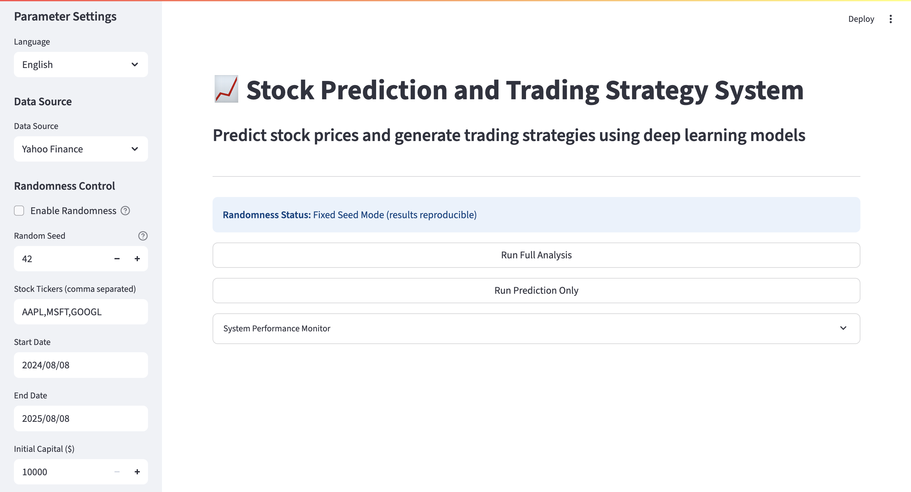
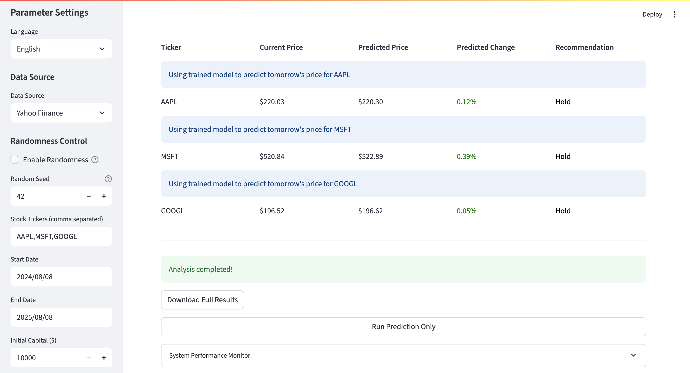

# LSTM-Stock-Predictor

English | [中文](README.md)

> **Note**: Developed through learning based on the [stock_trading](https://github.com/MilleXi/stock_trading) project.

> **Important**: This project is solely a result of learning and practicing LSTM technology, and does not constitute any form of investment advice. Its prediction results are also not accurate for reference.

---

A stock prediction system based on LSTM prediction and reinforcement learning. This system combines the predictive capabilities of deep learning with the decision-making capabilities of reinforcement learning to automatically perform stock price prediction and trading decisions.

## Project Features

- Uses LSTM for stock price trend prediction
- Employs Deep Evolution Strategy (DES) for trading decisions
- Complete data processing and feature engineering
- Visualization interface for prediction and trading results
- Supports batch processing of multiple stocks
- Multi-data source support (Yahoo Finance, AKShare)
- Multi-language interface support (Chinese/English)

## Main Features

### 1. Stock Data Acquisition and Preprocessing
- Supports multiple data sources: Yahoo Finance and AKShare
- Automatically downloads and preprocesses historical stock data
- Calculates various technical indicators (moving averages, RSI, MACD, Bollinger Bands, etc.)
- Fixed future data leakage issues in technical indicator calculations

### 2. LSTM Price Prediction
- Uses Long Short-Term Memory (LSTM) network model to predict stock prices
- Provides next-day price prediction functionality
- Visualizes prediction results compared to actual prices
- Generates investment recommendations (buy/sell/hold)

### 3. Reinforcement Learning Trading Strategy
- Reinforcement learning model based on Deep Evolution Strategy
- Generates buy/sell signals
- Simulates trading and calculates investment returns
- Risk-adjusted performance analysis (Sharpe ratio, Sortino ratio, maximum drawdown, etc.)

### 4. Visualization Analysis
- Price prediction vs. actual trend comparison charts
- Trading signal visualization (buy/sell point markers)
- Feature importance analysis
- Cumulative return curves

### 5. Multi-language Support
- Supports Chinese/English interface switching
- All analysis results and charts automatically adapt based on language settings

## Technology Stack

- **Deep Learning Framework**: PyTorch
- **Data Processing**: Pandas, NumPy
- **Data Acquisition**: yfinance, AKShare
- **Visualization**: Matplotlib, Seaborn, Streamlit
- **Optimization Algorithm**: Deep Evolution Strategy (DES)
- **Interface**: Streamlit

## Installation Guide

### Prerequisites
- Python 3.7+
- pip

### Installation Steps

1. Clone the repository:
```bash
git clone https://github.com/zengplus/LSTM-Stock-Predictor.git
cd LSTM-Stock-Predictor
```

2. Install dependencies:
```bash
pip install -r requirements.txt
```

## Usage Instructions

### Running the Application
```bash
streamlit run app.py
```

### Interface Operation Guide

1. **Sidebar Parameter Settings**:
   - Enter stock codes (multiple codes separated by commas)
   - Set date range
   - Adjust initial capital, training rounds, and other parameters
   - Select data source (Yahoo Finance or AKShare)
   - Set language (Chinese/English)

2. **Function Buttons**:
   - **Run Full Analysis**: Execute data acquisition, model training, prediction, and trading strategy generation
   - **Get Tomorrow's Prediction Only**: Quickly obtain tomorrow's price prediction and investment recommendations

3. **Result Display**:
   - Stock prediction results (RMSE, MAE, accuracy)
   - Trading strategy analysis (total returns, investment return rate)
   - Tomorrow's price prediction and investment recommendations
   - Visualization charts (price trends, trading signals, etc.)

#### Home Page Example


#### Results Page Example


## Project Structure

```
LSTM-Stock-Predictor/
├── results/                # Analysis results storage directory
│   └── session_{timestamp}/ # Session directory named with timestamp
│       ├── analytics/        # Analysis reports
│       ├── feature_importance/ # Feature importance analysis results
│       ├── models/           # Saved models
│       ├── predictions/      # Prediction results
│       ├── scalers/          # Normalizers
│       ├── trading/          # Trading records
│       └── session_summary.json # Session summary
├── data/                   # Stock data storage directory
├── images/                 # Project documentation images directory
├── app.py                  # Main application
├── requirements.txt        # Dependencies list
├── README.md               # Chinese Project documentation
├── README.md               # English Project documentation
└── LICENSE                 # License file
```


## License

This project is licensed under the MIT License - see the LICENSE file for details.

---

**Important Notice**: Stock market investment involves risks. The predictions and recommendations provided by this tool are for reference only and do not constitute investment advice. Actual investment decisions should be made with caution. This project is for learning and research purposes only. 